# afbilko-mobil
AFBİLKO - Afet Bilgilendirme ve Koordinasyon Sistemi (Android App)

Afbilko, afet anlarında kullanıcılar arasında hızlı bilgi paylaşımı, koordinasyon ve yardımlaşma sağlamak amacıyla geliştirilmiş Android tabanlı bir mobil uygulamadır. Özgün yönü; gönüllüler ve afetzedeler arasında birebir etkileşim imkanı sunarak yardımlaşmayı daha hızlı ve verimli kılmasıdır.

🚀 Öne Çıkan Özellikler
- Gerçek Zamanlı Veri Akışı & Koordinasyon: Afetzedeler ve gönüllüler arasında anlık etkileşim sağlayan canlı ekosistem.
- Erişilebilirlik Desteği (Sesli Komut): Afetzedelerin acil durumlarda klavye kullanmalarına gerek kalmadan, sesli komut (Speech-to-Text) yardımıyla yardım talebi oluşturabilme özelliği.
- Kategori Tabanlı Yardım Çağrıları: İhtiyaç türüne (Gıda, Sağlık, Barınma vb.) göre özelleştirilmiş kategori seçimi ile daha hızlı ve doğru tasnif.
- Görsel Harita Yönetimi: Tüm yardım çağrılarının harita üzerinde kategoriye özel farklı ikonlarla anlık olarak gösterilmesi.
- Akıllı Filtreleme Algoritması: Gönüllülerin, kategoriye göre filtreleme yapabilmesinin yanı sıra, kendi konumlarına göre 50 km çapındaki yardım çağrılarını bir çember (radius) içinde görmelerini sağlayan lokasyon bazlı filtreleme sistemi.
- Entegre Navigasyon Sistemi: Toplanma noktaları veya yardım bildirimi konumları için uygulama içi yol tarifi. Ayrıca kullanıcılar dilerse tek tıkla Google Haritalar üzerinden harici navigasyon da başlatabilir.
- Eğitici İçerik & Afet Bilinci: Afetler, afet öncesi, sırası ve sonrasında yapılması gerekenleri ve afet bilincini oluşturmak amacıyla oluşturulan kapsamlı bilgilendirme sayfaları.
- Güvenli Giriş: Firebase Authentication ile yüksek güvenlikli kullanıcı doğrulama ve veri koruma.
- Güvenlik & Doğrulama: Asılsız veya trol içerikli bildirimlerin kullanıcılar tarafından raporlanabilmesi.
- Kapsamlı Admin Paneli: Tüm raporlanan içerikleri yönetebilmeyi (ban, askıya alma, mail üzerinden bildiri işlemleri) sağlayan merkezi yönetim arayüzü.
- Anahtar Kelime Odaklı Chatbot: Acil durumlarda kullanıcı sorularındaki anahtar kelimeleri analiz ederek ilgili çözüm ve rehberlik metinlerini anında sunan kural tabanlı sohbet asistanı.

🛠️ Kullanılan Teknolojiler
- Dil: Java
- Platform: Android Studio
- Veritabanı: Cloud Firestore (NoSQL tabanlı, esnek ve ölçeklenebilir doküman veritabanı).
- Kullanıcı Doğrulama: Firebase Authentication (Güvenli e-posta ve şifre tabanlı giriş sistemi).
- Dosya Depolama: Firebase Storage (Kullanıcı profil fotoğrafları ve ihbar görsellerinin güvenli bir şekilde saklanması).
- Mimari: Modüler Mobil Uygulama Mimarisi
- Güvenlik Notu: Projenin güvenliği için hassas yapılandırma dosyaları (google-services.json) depodan hariç tutulmuştur. Uygulama, arka planda tarafımca yönetilen veritabanı ile çalışmaya devam etmektedir. Uygulama gerçek zamanlı veri akışı için Firebase veritabanını kullanmaktadır.

📲 Uygulamayı Deneyimleyin (Demo)

1- APK İndir: [📲 Afbilko APK dosyasını indirmek için buraya tıkla](https://github.com/guvezbuse/afbilko-mobil/raw/main/APK/afbilko.apk)

2- Kurulum Notu: Uygulamayı kurarken telefonunuz "Bilinmeyen kaynaklardan uygulama yükle" uyarısı verebilir. Kuruluma devam edebilmek için bu izni vermeniz gerekmektedir.
Ayarlar > Güvenlik > Bilinmeyen Kaynaklar kısmından veya yükleme sırasında çıkan uyarı ekranından "Bu kaynağa izin ver" diyerek devam edebilirsiniz.

3- Uygulamayı indirdikten sonra saniyeler içinde kendi hesabınızı oluşturabilir ve konumunuzun açık olduğundan emin olarak sistemi test etmeye başlayabilirsiniz.

📸 Ekran Görüntüleri
<table align="center">
  <tr>
    <td>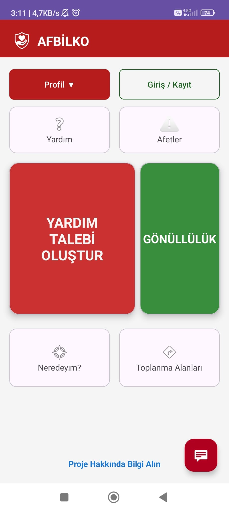</td>
    <td>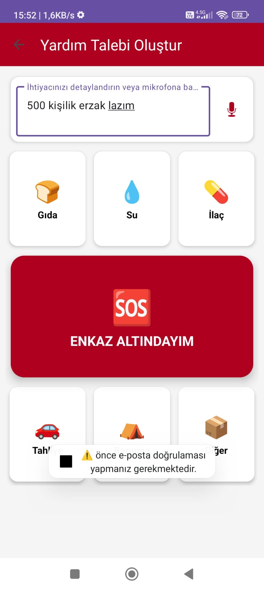</td>
    <td>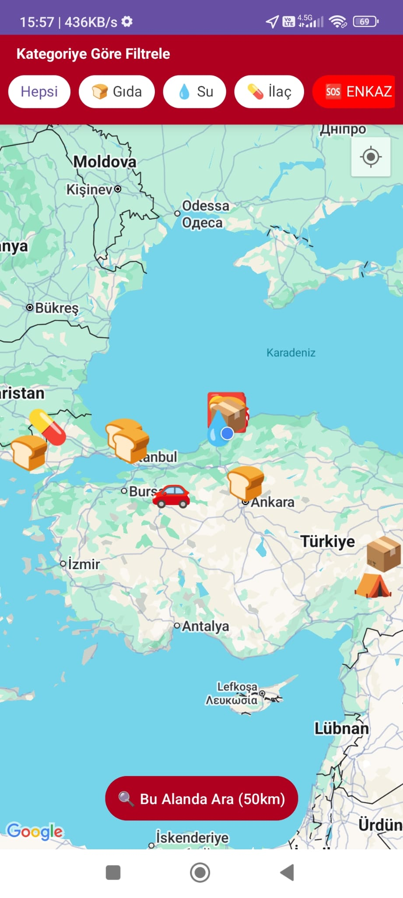</td>
   <td>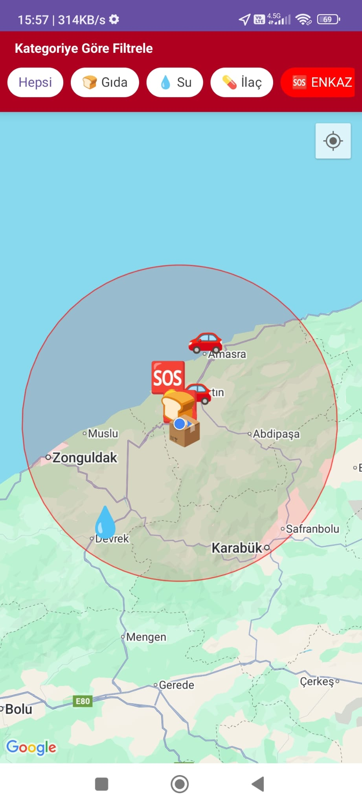</td>
  </tr>
  <tr>
   <td>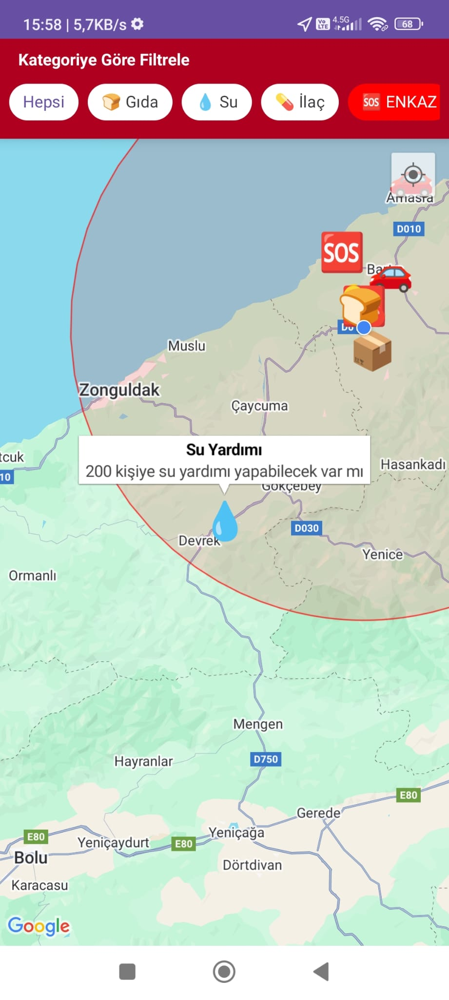</td>
    <td>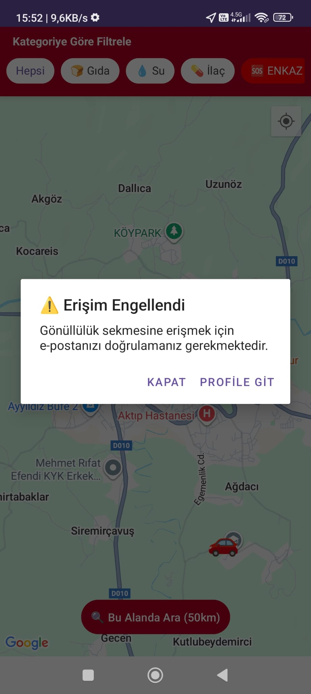</td>
    <td>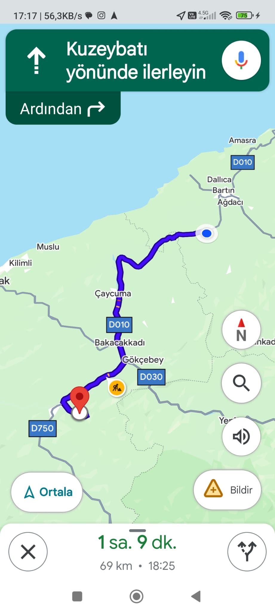</td>
    <td>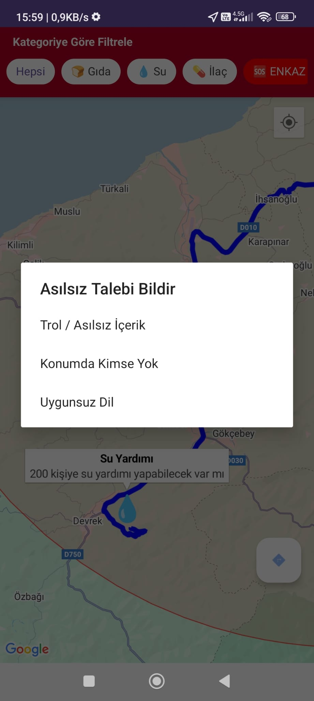</td>
  </tr>
 <tr>
   <td>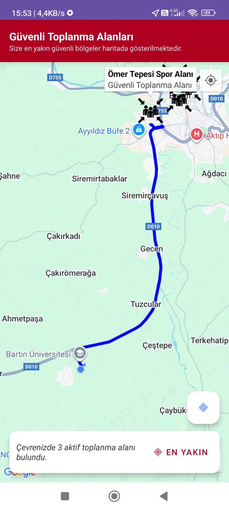</td>
    <td>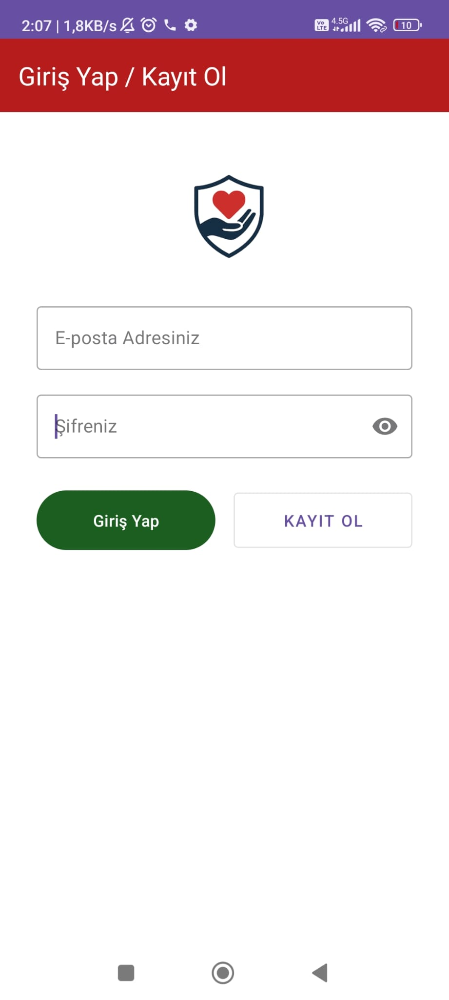</td>
    <td>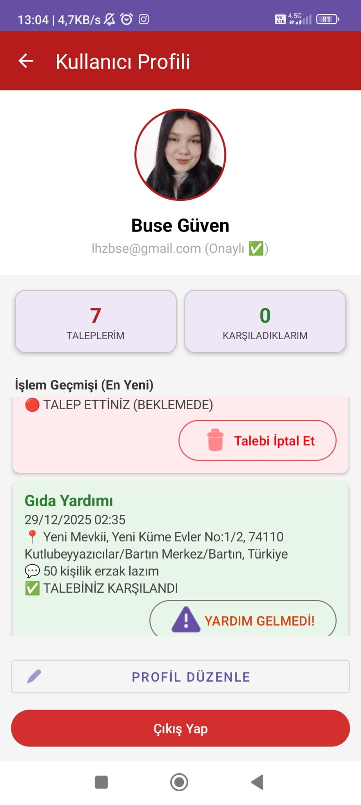</td>
    <td>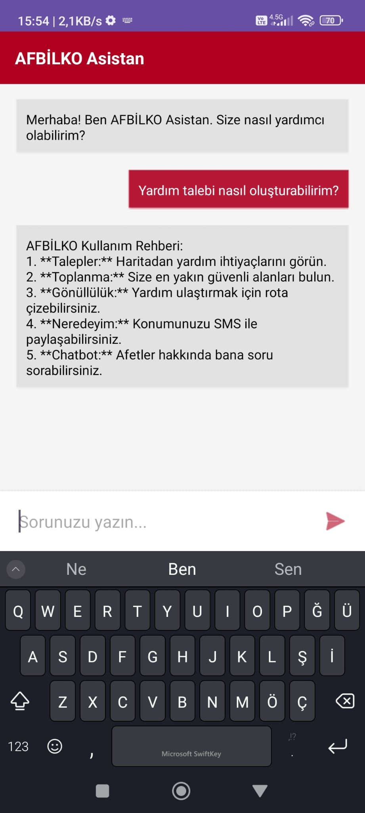</td>
  </tr>
 <tr>
   <td>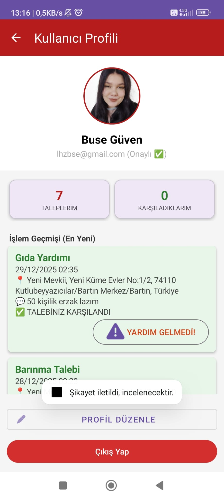</td>
    <td>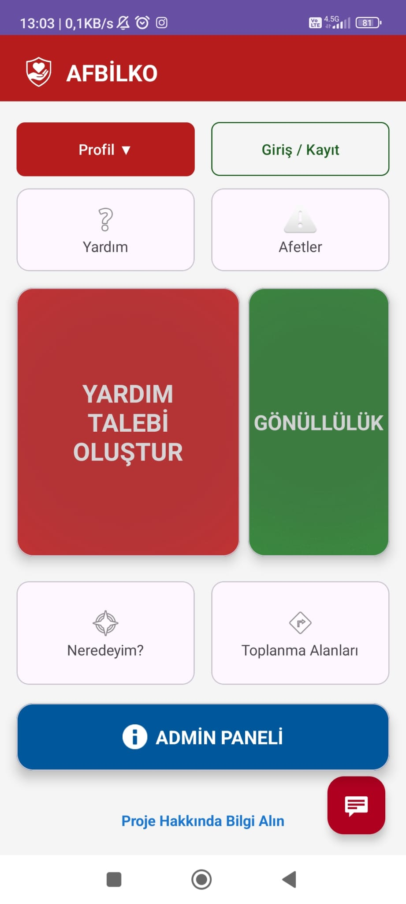</td>
    <td>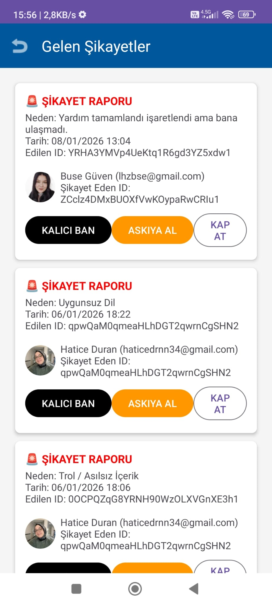</td>
     <td>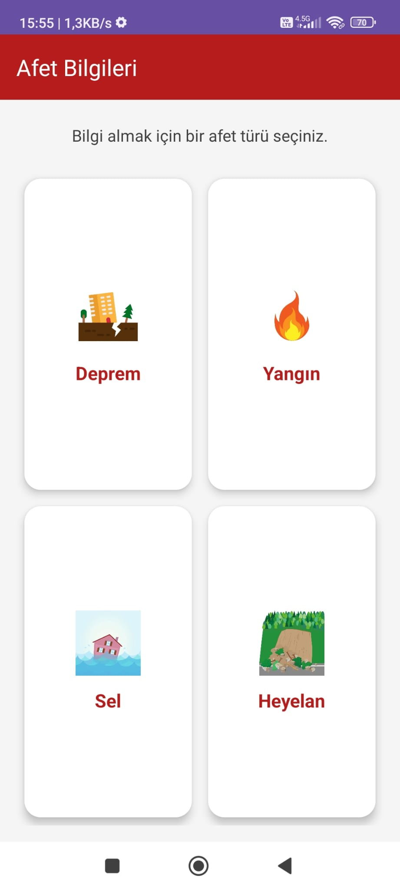</td>
    
  </tr>
  <tr>
   <td>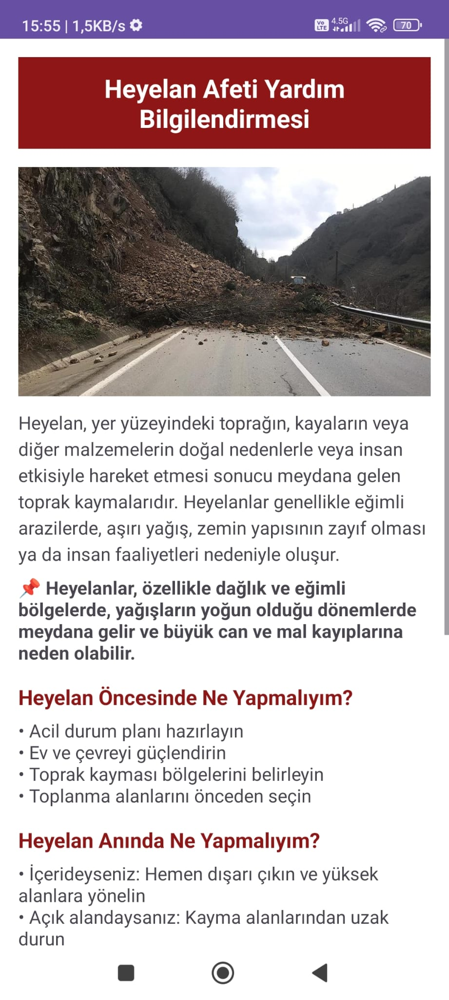</td>
    <td>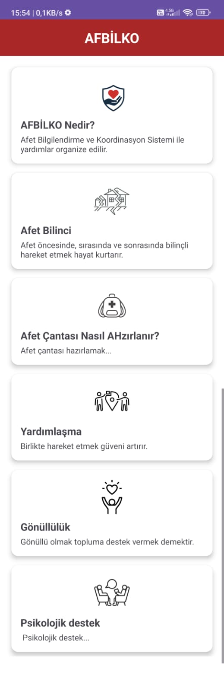</td>
    <td>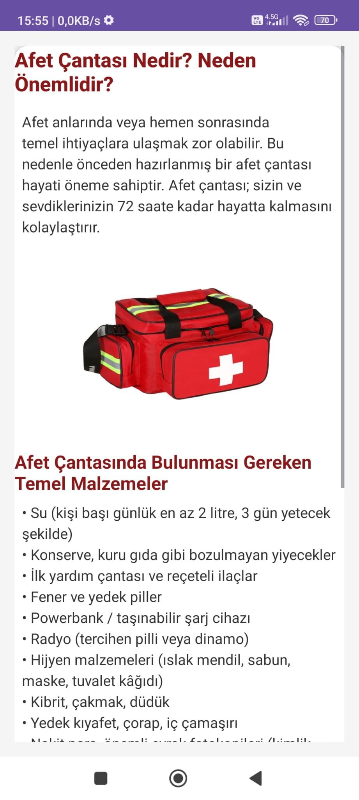</td>
     <td>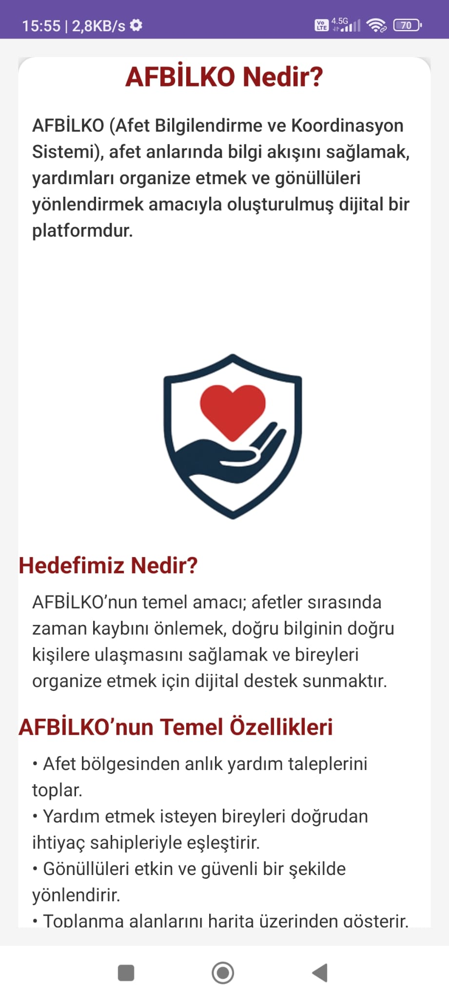</td>
    
  </tr>
</table>

